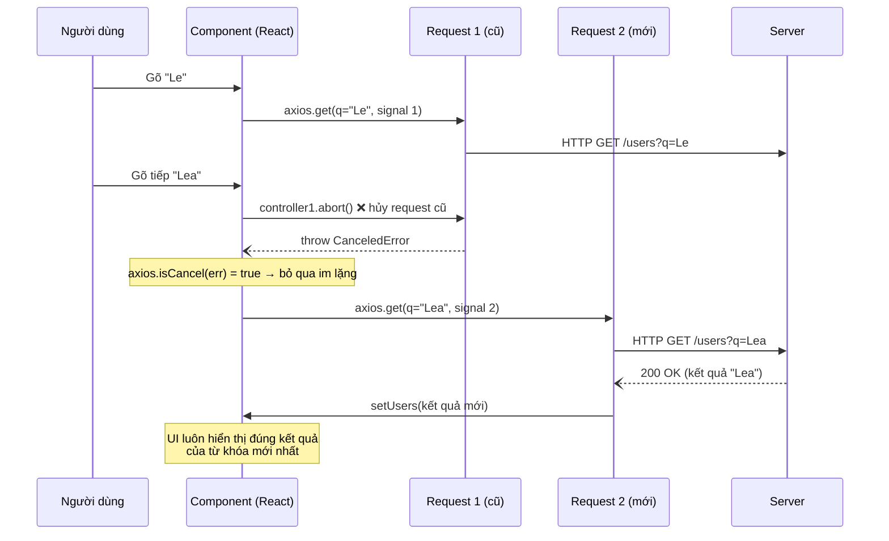

# [Bài 9 - Xuất sắc] Tối ưu hiệu suất với Kỹ thuật Hủy Request (Cancellation)

## Cách chạy

```bash
npm install
npm run dev
```

Gõ nhanh vào ô tìm kiếm — mỗi ký tự mới sẽ **hủy** request cũ đang bay
(`controller.abort()`) trước khi gửi request mới, tránh Race Condition khiến
kết quả cũ đè lên kết quả mới.

## Bẫy dữ liệu

Việc `abort()` khiến Axios ném lỗi vào khối `catch`. Code dùng `axios.isCancel(error)`
để phân biệt: nếu là hủy chủ động thì **bỏ qua im lặng** (không `console.error` rác),
chỉ lỗi mạng thật mới được log và báo cho người dùng.

## Sơ đồ luồng dữ liệu (Sequence diagram)


